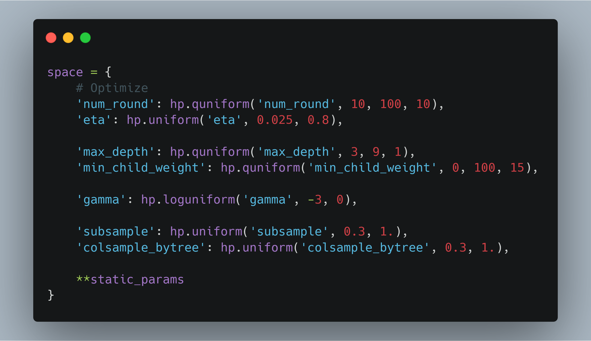
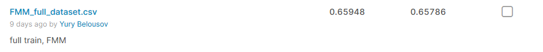
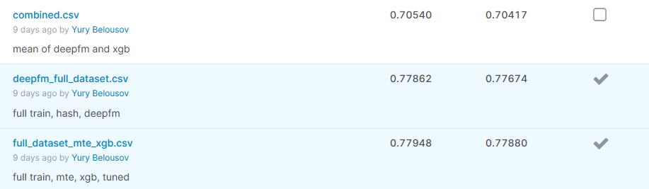
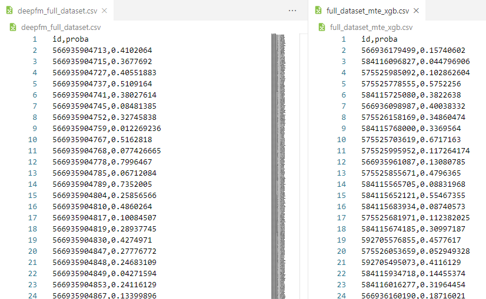
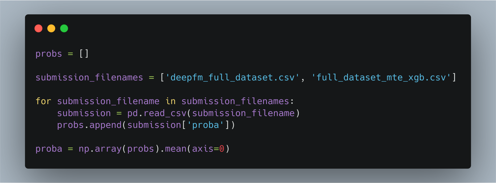
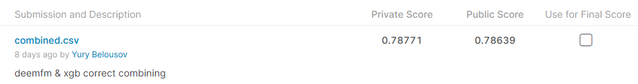

# CTR prediction

- [План](#план)
- [1. xgb](#1-xgb)
- [2. DeepCTR](#2-deepctr)
- [3. xlearn](#3-xlearn)
- [4. Ансамбль (самая интересная часть)](#4-ансамбль-самая-интересная-часть)

***

### План
Изначально планировал получить три решения:
1. xgb на всем датасете с hyperopt
2. Модель из [DeepCTR]
3. Модель из [xlearn]

***

### 1. xgb
Ключевые моменты:
* пробовал делать one hot encoding для всех категориальных фичей, и это даже считалось, но одна итерация обучения бустинга занимала около 30 минут, что очень долго для подбора параметров
* поэтому решил использовать другой подход для категориальных фичей: а именно [catboost encoder] из [categorical encoding] (правда этот пакет не умеет работать с pyspark, поэтому пришлось вначале сдеать все в pandas Dataframe, а затем перевести в spark — что могло бы являться проблемой, если данных было бы сильно больше)
* Для подбора параметров:
    * не просто `hp.choice`, так как зачастую есть порядок в гиперпараметрах (`num_round`, `eta`, ...), а `hp.quniform`, `hp.uniform` ([hyperopt parameter expresion])
    * решил подбирать все параметры *сразу*, а не поочередно
    * Общее пространство поиска параметров:
     
    * выставил 30 попыток, что, возможно, маловато
    * поиск занял 1 час 20 минут
    * лучшие параметры нашлись при последней (*sic!*) попытке
* Подбор параметро дал `1.4` прироста ate по roc-auc относительно модели со стандартными параметрами
* На kaggle с этим решением получил следующий результат:  
 
* (возможно), если бы отправил нетюненую модель, то все равно стал бы вторым
* Обучение на всем датасете дало `0.045` прироста по roc-auc в сравнении с обучением на случайной половине с подбором параметров (разница с моделью на половине без подбора - `0.056`), что достаточно много, и в очередной раз показывает, что обучение на подвыборке не самый лучший подход.
* код доступен в [01.ctr_xgb.ipynb](01.ctr_xgb.ipynb)

***

### 2. [DeepCTR]
* Понравилась библиотека, достаточно легко с ней работать.  
* Использовал самую стандартную модель [DeepFM], легко завести и работать (единственное что tensorflow почему-то не может строить граф с переменными, которые содержат нижнее подчеркивание, поэтому нужно обязательно переименовать колонки: `train.rename(columns=lambda x: x.replace('_', ''))`).
* и нужно обязательно dense фичи скастить к `np.float32`, а sparse к `string`
* Для категориальных фичей использовал [DeepCTR feature hashing]  
* На kaggle вполне хороший результат:  
 
* И это при том, что я не особо экспериментировал и побирал параметры
* код доступен в [02.1.ctr_deepctr_deepfm.ipynb](02.1.ctr_deepctr_deepfm.ipynb)
* После окончания контеста попробовал другую модель: [FGCNN], и она тоже показала себя неплохо (правда обучалась в 4 раза дольше):  
 
* код доступен в [02.2.ctr_deepctr_fgcnn.ipynb](02.2.ctr_deepctr_fgcnn.ipynb)

***

### 3. [xlearn]
* Захотел использовать алгоритм FFM, который использовался в выигрышном решении оригинального соревнования. Но оригинальная реализация ([LIBFFM]) достаточно древняя, поэтому решил использовать более новую и быструю (по заявлению авторов) реализацию [xlearn]
* Однако этот интерфейс я тоже не до конца понял, а именно что за `libffm` формат (конкретно как составляется [field]).
* Поэтому использовал просто factorization machine (FM), так как нашел понятный [FM пример] с использованием scikit learn api.
* Но результат совсем не очень:  
 
* код доступен в [03.ctr_xl_fm.ipynb](03.ctr_xl_fm.ipynb)

***
 
### 4. Ансамбль (самая интересная часть)
* Как известно, зачастую в соревнованиях побеждают комбинации различных алгоритмов (а формально — теорема Кондорсе о присяжных).  
* Поэтому я захотел объединить результаты первого и второго подхода.  
* Быстро написав и отправив код, я очень удивился:  

* Так как результат объединения **сильно** хуже каждого из подхода по отдельности.
* Это была последняя попытка в последний день, поэтому я ничего не мог уже исправить
* Лишь на следующий день, когда я посмотрел на результаты первых двух подходов:  
 
я заметил, что в csv от pyspark `id` идут группами по 5 (возможно это количество партиций).
* а вот как у меня было написано объединение:  

* то есть у меня никак не учитывался порядок `id` :sob: :sob: :sob:
* Для исправления достаточно было добавить `sort_values` или, ещё лучше, написать через `merge`.
* В итоге, исправив, я получил следующий результат:  

Что почти на `0.01` больше чем у первого места :(
* *неправильный* код доступен в [04.CombineSolutions.ipynb](04.CombineSolutions.ipynb)

[DeepCTR]: https://github.com/shenweichen/DeepCTR
[DeepCTR feature hashing]: https://deepctr-doc.readthedocs.io/en/latest/Examples.html#classification-criteo-with-feature-hashing-on-the-fly
[DeepFM]: https://deepctr-doc.readthedocs.io/en/latest/deepctr.models.deepfm.html
[FGCNN]: https://deepctr-doc.readthedocs.io/en/latest/deepctr.models.fgcnn.html
[hyperopt parameter expresion]: https://github.com/hyperopt/hyperopt/wiki/FMin#21-parameter-expressions
[categorical encoding]: https://contrib.scikit-learn.org/categorical-encoding/
[catboost encoder]: https://contrib.scikit-learn.org/categorical-encoding/catboost.html
[xlearn]: https://github.com/aksnzhy/xlearn
[LIBFFM]: https://www.csie.ntu.edu.tw/~r01922136/libffm/
[field]: https://github.com/ycjuan/libffm/blob/94eb4c8fd8c63b5b292512fa8e952e1ecc83c1b2/README#L123
[FM пример]: https://github.com/aksnzhy/xlearn/blob/9bec664c7b0844b70b77b2de8a0e22fae008f486/demo/classification/scikit_learn_demo/example_FM_wine.py